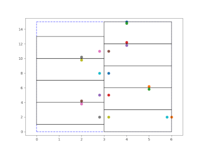

# SMT Macro Placer
VLSI MacroPlacer for System on Chip Design

Macro Placement for System on Chip design based on solving engines for the Satisfiability Modulo Theories  like z3. 

SMT_MacroPlacer heavily depends on external modules and libraries. External modules used in this build are getting resolved automatically. External libraries have to provided by the user.

The tool is developed using Arch Linux and is tested using CI for Ubuntu 20.04 LTS.

In oder to resolve the packages needed for Ubuntu 20.04 LTS, please make sure the following packages have been installed:

- git
- libboost-program-options-dev
- libboost-filesystem-dev
- g++
- doxygen
- graphviz
- bison
- zlib1g-dev
- python-numpy (Python2)
- python2-dev
- libjsoncpp-dev
- libsqlite3-dev

If the package manager can not resolve the Python2 packages, please add the **universe** repository to your system via "apt-add-repository universe".

SMT_MacroPlacer is configured by using command line arguments which can be applied via the command line or config.ini files placed into the folder holding the source files.

In order to execute the tool for a benchmark like 03_benchmarks/wiring/boxes_3 you have to navigate to the folder an run:
smt_placer  --lef=boxes.lef  \
            --def=boxes.def  \
            --site=CORE \
            --store-log=true \
            --store-smt=true \
            --minimize-area \
            --free-terminals \
            --minimize-hpwl \
            --dump-all \
            --pareto \
            --verbose  \
            --solutions=2  

Running this command will use the benchmark stored in the boxes.lef/def files and tries to minimize the used area for placement as well as the length of the Half Perimetric Wireleght by invoking a Pareto Optimizer and searching for two solution. The generated solutions are gettings stored in the results folder under its specific results ID. If you want to export the generated placement please considering using the --save-all/--save-best  options

SMT_MacroPlacer is developed at the Institute for Integrated Circuits at the Johannes Kepler University Linz, Austria in cooperation with Infineon Technologies Duisburg, Germany.

